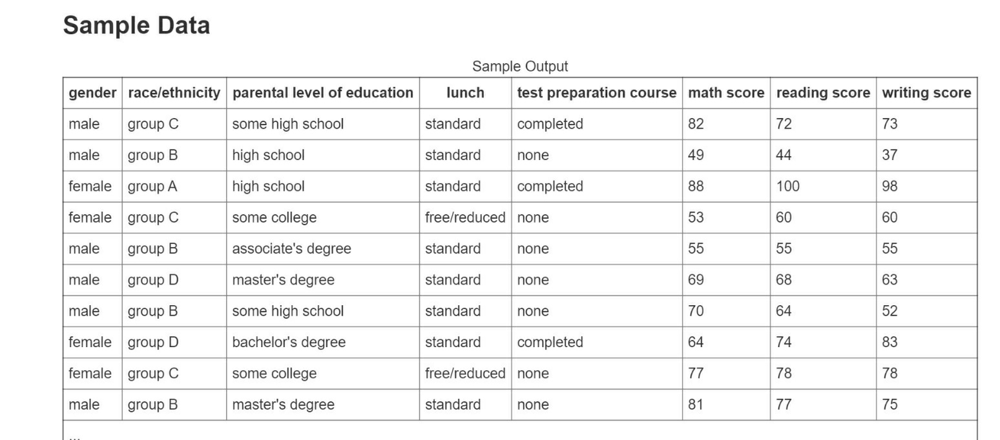

# Machine-learning-Final-project

In this project we use the "Students Performance in Exams" Dataset -https://www.kaggle.com/spscientist/students-performance-in-exams,
the Dataset created To understand the influence of the parents background, test preparation etc on students performance.
This data set includes scores from three exams and a variety of personal, social, and economic factors that have interaction effects upon them.

We used four methods on the Dataset to answer the following questions:

1) "Given the average grades and ethnicity - what is the gender of the student?".

2) "Based on all the information, what is the student's ethnicity

3) "Based on grades and sector What is the early education the student received?".

Here are the methods and success rates of each method:

Ouestion #1:

| Method        | Success rate |
| ------------- | ------------- |
| Adaboost      | 0.854  |
| SVM           |  0.874  |
| K-NN          | 0.826  |
| Logistic Regression  | 0.844  |

*At first we calculated the average of the three scores and put in one column that we calculated in the algorithm, the accuracy did not turn out well and when we treated all three scores separately the accuracy increased.

Ouestion #2:

| Method        | Success rate |
| ------------- | ------------- |
| Adaboost      | 0.697  |
| SVM           | 0.525  |
| K-NN          | 0.690  |
| Logistic Regression  | 0.611  |

*Here we used duplication because there are five sectors and we wanted to classify according to five criteria and not two - what we did was we took each type of sector and ran it in an algorithm with each of the other four sectors, we summed up the accuracy and by doing so we were able to classify the five sectors.

Ouestion #3:

| Method        | Success rate |
| ------------- | ------------- |
| Adaboost      | 0.559  |
| SVM           | 0.521  |
| K-NN          | 0.526  |
| Logistic Regression  | 0.535  |
