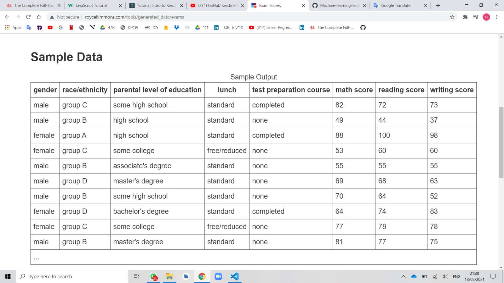

# Machine-learning-Final-project

In this project we use the "Students Performance in Exams" Dataset -https://www.kaggle.com/spscientist/students-performance-in-exams,
the Dataset created To understand the influence of the parents background, test preparation etc on students performance.
This data set includes scores from three exams and a variety of personal, social, and economic factors that have interaction effects upon them.

And we used four methods on the Dataset to answer the question:"Given the average grades and ethnicity - what is the gender of the student?".

Here are the methods and success rates of each method:

| Method        | Success rate |
| ------------- | ------------- |
| Adaboost      | Content Cell  |
| SVM           | Content Cell  |
| K-NN          | Content Cell  |
| Logistic Regression  | Content Cell  |
